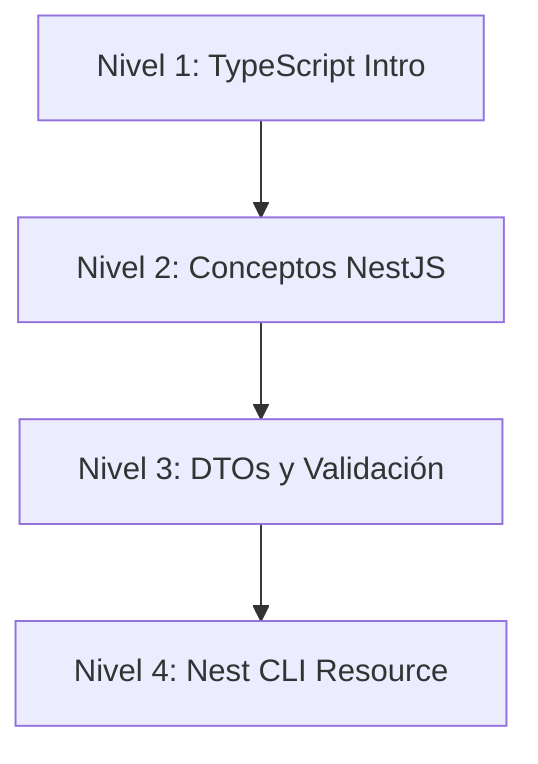
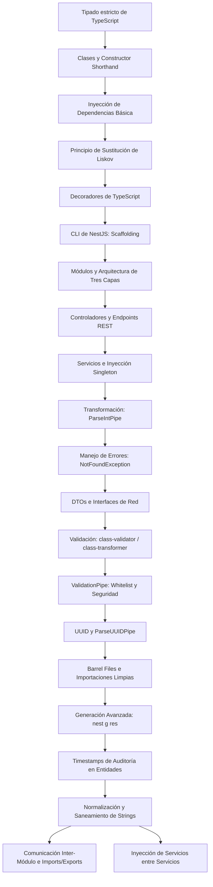
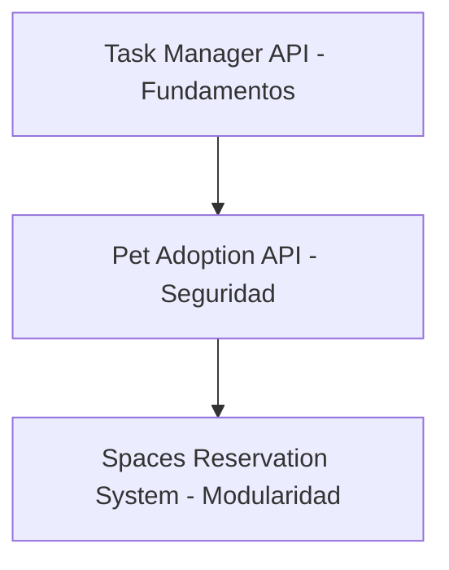
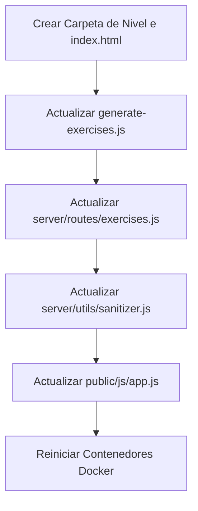

# Architecture & Pedagogy Guide (ARCHITECTURE.md)

Este documento detalla la arquitectura de software, la metodología de enseñanza, la estructura de ejercicios y las directrices operativas del repositorio educativo **NestJS Educativo**. Sirve como fuente de verdad para estudiantes, instructores y agentes de IA que mantengan o expandan la plataforma.

---

## 1. Project Overview

### Objetivo Educativo
El repositorio está diseñado como una plataforma de aprendizaje interactiva y autónoma para dominar **TypeScript** y **NestJS**. A diferencia de los repositorios de negocios tradicionales, este proyecto separa la infraestructura de tutoría automatizada de los proyectos prácticos de los alumnos. El objetivo es proporcionar retroalimentación en tiempo real a través de un compilador y ejecutor de pruebas aislado en un sandbox seguro, guiando al estudiante paso a paso.

### Público Objetivo
Desarrolladores con experiencia previa en JavaScript moderno (ES6+) que buscan especializarse en la construcción de APIs del lado del servidor robustas, tipadas y escalables utilizando la arquitectura orientada a la empresa de NestJS.

### Nivel de Dificultad Esperado
Desde **Principiante** en TypeScript y fundamentos de backend, ascendiendo de manera estrictamente lineal hasta un nivel **Intermedio-Avanzado** en NestJS, abordando validaciones estrictas de red, inyección de dependencias modular y andamiaje profesional de micro-servicios REST.

### Tecnologías Enseñadas
* **Lenguaje:** TypeScript (Tipado estricto, Interfaces, Clases, Genéricos, Decoradores).
* **Framework Backend:** NestJS (CLI, Módulos, Controladores, Proveedores, Pipes, Filters).
* **Herramientas de Validación:** class-validator, class-transformer, UUID v4.
* **Infraestructura Educativa:** Node.js, Express (servidor evaluador), Docker, Vitest.

---

## 2. Learning Roadmap

El currículo está dividido en niveles secuenciales donde cada nivel introduce conceptos teóricos que son inmediatamente puestos a prueba en ejercicios prácticos y un desafío de integración al final.



### Detalle de Niveles

#### Nivel 1: TypeScript para NestJS
* **Objetivo:** Dominar las características clave de TypeScript necesarias para entender la sintaxis y comportamiento de NestJS.
* **Conocimientos Adquiridos:** Tipos primitivos, desestructuración, promesas/asincronía, encapsulamiento en clases, getters, inyección de dependencias básica en POO, genéricos y decoradores.
* **Requisitos Previos:** JavaScript básico (ES6+).
* **Dependencias:** Ninguna.

#### Nivel 2: Conceptos Fundamentales de NestJS
* **Objetivo:** Comprender la arquitectura de tres capas de NestJS y crear un CRUD en memoria.
* **Conocimientos Adquiridos:** CLI de NestJS (`nest g`), estructura del Root Module, controladores, enrutamiento y verbos HTTP, inyección de dependencias singleton, `ParseIntPipe` y manejo de excepciones mediante `NotFoundException`.
* **Requisitos Previos:** Nivel 1 (Clases, interfaces y DI en POO).
* **Dependencias:** Nivel 1.

#### Nivel 3: DTOs y Validación de Información
* **Objetivo:** Implementar seguridad y saneamiento estricto en la capa de entrada del servidor.
* **Conocimientos Adquiridos:** Diferencias entre interfaces y clases en tiempo de ejecución, Data Transfer Objects (DTOs), decoración con `class-validator`, ValidationPipe global (`whitelist`, `forbidNonWhitelisted`), validación paramétrica con `ParseUUIDPipe` y organización de código mediante Barrel Files.
* **Requisitos Previos:** Nivel 2 (Controladores, inyección de servicios, decoradores de extracción de datos `@Body` y `@Param`).
* **Dependencias:** Nivel 2.

#### Nivel 4: Nest CLI Resource y Módulos Avanzados
* **Objetivo:** Optimizar el tiempo de desarrollo usando andamiaje inteligente y aprender la comunicación inter-módulo.
* **Conocimientos Adquiridos:** Comando `nest g res` para generación CRUD, flags avanzadas del CLI (`--dry-run`, `--no-spec`), timestamps de auditoría (`createdAt`/`updatedAt`), normalización y saneamiento de entradas de texto, y exportación/importación de proveedores a través de módulos.
* **Requisitos Previos:** Nivel 3 (Arquitectura completa de un recurso, DTOs y validación).
* **Dependencias:** Nivel 3.

---

## 3. Repository Structure

El repositorio está organizado en tres partes claramente delimitadas:

```text
nestjs-educativo-root/
├── 01-typescript-intro/               # Proyecto de práctica en local para el alumno (Nivel 1)
├── 02-car-dealership/                 # Proyecto de práctica en local para el alumno (Niveles 2, 3, 4)
└── nestjs-educativo/                  # PLATAFORMA EDUCATIVA (Servidor de evaluación + Frontend)
    ├── Dockerfile                     # Configuración del sandbox de ejecución
    ├── generate-exercises.js          # Compilador maestro de ejercicios del backend
    ├── exercises/                     # Material pedagógico
    │   ├── nivel_1_typescript_intro/
    │   │   ├── README.md              # Teoría exhaustiva del Nivel 1
    │   │   └── exercises.json         # Ejercicios autoevaluables de TS
    │   └── nivel_X_...                # Sucesión de niveles de NestJS
    ├── server/                        # API de validación y sandbox
    │   ├── server.js                  # Servidor Express
    │   ├── routes/exercises.js        # Rutas de evaluación de código
    │   ├── services/                  # Motores de ejecución segura
    │   │   ├── dockerExecutor.js      # Sandbox de ejecución de TypeScript
    │   │   └── validator.js           # Orquestador del testing
    │   └── utils/                     # Sanitizadores y utilidades
    ├── public/                        # SPA Web (Interfaz de usuario)
    │   ├── index.html                 # Grid de niveles y dashboard
    │   ├── js/                        # Sistema de archivos virtual (VFS) y editor Monaco
    │   └── css/                       # Estilos CSS
    └── tests/                         # Tests de integración globales
        └── validation.test.js         # Asegura la consistencia del evaluador con Vitest
```

### Responsabilidad de Componentes Clave de la Plataforma
* **`dockerExecutor.js`**: Recibe el código del alumno desde el frontend web, lo escribe en un directorio temporal (`/tmp`), crea enlaces simbólicos a `node_modules` para que las dependencias de NestJS estén disponibles de forma segura, y compila/ejecuta el script de prueba mediante `tsc --noEmit && ts-node`.
* **`sanitizer.js`**: Valida que los IDs de nivel y ejercicio solicitados estén dentro de los límites válidos de seguridad del servidor y mitiga riesgos de inyección de código.
* **`nest-cli.js`**: Un simulador en el frontend que recrea de manera visual y lógica el comportamiento de la CLI oficial de NestJS, creando la estructura de carpetas en el sistema de archivos virtual (VFS) del alumno al ejecutar comandos de terminal como `nest g co`.

---

## 4. Educational Architecture

La plataforma opera bajo el paradigma de **Estudio Guiado Interactivo**:

1. **Lectura Teórica (Readme)**: El alumno abre el `README.md` del nivel actual. Este documento es auto-contenido y proporciona explicaciones conceptuales y fragmentos de código listos para analizar.
2. **Carga del Ejercicio (JSON)**: El frontend carga la descripción, el código base (`files`) y las pistas desde el `exercises.json` del nivel seleccionado.
3. **Desarrollo en el Editor Virtual**: El alumno escribe su solución en un editor de código embebido. Si el ejercicio requiere la CLI, la terminal virtual ejecuta las modificaciones estructurales en el sistema de archivos virtual (VFS).
4. **Validación Automatizada (Test Script)**: Al enviar la solución, el servidor ejecuta un script de validación (`test_script`) escrito en TypeScript con `@nestjs/testing`. Si el código compila y cumple con las afirmaciones del test, se desbloquea el siguiente paso.
5. **Desafíos Integradores**: Al finalizar los ejercicios de sintaxis o unitarios, el alumno debe construir una API funcional pequeña (To-Do API, Pet Adoption API, Spaces Reservation System) que requiere ensamblar múltiples componentes desde cero.

---

## 5. NestJS Concepts Covered

El repositorio enseña de manera profunda los siguientes conceptos estructurales de NestJS:

* **Modules (`@Module`)**: La base organizativa del framework. Se enseña a encapsular la lógica por dominio (ej. `CarsModule`, `BrandsModule`) y el uso de `imports` y `exports` para permitir la comunicación segura entre diferentes módulos.
* **Controllers (`@Controller`)**: Capa receptora de peticiones de red. Se aborda el mapeo de rutas, uso de verbos HTTP (`@Get`, `@Post`, `@Patch`, `@Delete`) y la inyección de decoradores de extracción de datos (`@Param`, `@Body`, `@Query`).
* **Providers y Services (`@Injectable`)**: Capa de lógica de negocio. Se enseña a crear servicios que gestionen el estado de los datos (en memoria) y a inyectarlos de manera segura.
* **Inyección de Dependencias (DI)**: Inyección basada en el constructor de TypeScript usando el atajo `private readonly`, explicando el patrón de diseño singleton por defecto y el desacoplamiento de clases.
* **DTOs (Data Transfer Objects)**: Clases que modelan los datos de entrada por la red. Se enseña a estructurar payloads de creación y actualización (usando `PartialType` de `@nestjs/mapped-types`).
* **Pipes**: Validadores y transformadores de datos de entrada. Se analizan pipes incorporados (`ParseIntPipe`, `ParseUUIDPipe`) y su aplicación global mediante `ValidationPipe` en conjunto con las directivas de saneamiento `whitelist` y `forbidNonWhitelisted`.
* **Exception Filters**: Envío de respuestas HTTP estandarizadas a partir de excepciones de lógica de negocio. Se enseña el uso de `NotFoundException`, `BadRequestException`, etc.
* **Organización y Helpers**: Uso de Barrel Files (`index.ts`) para mantener limpias las exportaciones e importaciones de DTOs y entidades, y uso de alias de directorios en TypeScript.

---

## 6. Learning Dependencies Graph

El siguiente diagrama detalla la jerarquía de conocimientos y el orden de dependencia estricto de los temas cubiertos en el repositorio:



---

## 7. Exercises

El repositorio contiene **31 ejercicios** autoevaluables distribuidos de la siguiente manera:

### Nivel 1: TypeScript para NestJS (13 Ejercicios)

| ID | Ejercicio | Objetivo | Conceptos Clave | Archivo Evaluado |
| :-: | --- | --- | --- | --- |
| **1** | Tipado Explícito y Tipos Básicos | Declarar variables con tipos estrictos. | `string`, `number`, `boolean`, `array`, `any` | `initial_script` |
| **2** | Template Strings Multilínea | Generar bloques HTML estructurados con interpolación. | `Template Strings`, `Interpolación` | `initial_script` |
| **3** | Procesamiento de Arrays | Filtrar colecciones de objetos y mapear campos. | `filter`, `map`, `Arrow functions` | `initial_script` |
| **4** | Desestructuración Profunda | Extraer propiedades anidadas y renombrarlas en una línea. | `Destructuring`, `Renombrado` | `initial_script` |
| **5** | Interfaces Anidadas | Modelar contratos complejos que involucren arreglos de sub-interfaces. | `interface`, `opcional (?)` | `initial_script` |
| **6** | Clases, Shorthand y Métodos | Declarar clases con modificadores de acceso directos en el constructor. | `constructor shorthand`, `public`, `private` | `initial_script` |
| **7** | Encapsulamiento con Getters | Proteger propiedades internas y exponer getters calculados. | `get`, `private`, `this` | `initial_script` |
| **8** | Clases Estáticas (Factorías) | Crear utilidades y generadores sin instanciar la clase base. | `static`, `factory pattern` | `initial_script` |
| **9** | Promesas Avanzadas y Throw | Validar flujos asíncronos y rechazar promesas lanzando errores. | `async/await`, `Promise`, `throw Error` | `initial_script` |
| **10** | Inyección de Dependencias | Inyectar implementaciones concretas que cumplan con una interfaz. | `implements`, `Logger interface` | `initial_script` |
| **11** | Sustitución de Liskov | Lograr polimorfismo con clases abstractas y métodos abstractos. | `abstract class`, `abstract method` | `initial_script` |
| **12** | Genéricos | Crear wrappers de respuestas HTTP de tipado dinámico. | `Genéricos <T>`, `Response Wrapper` | `initial_script` |
| **13** | Decoradores de Método | Interceptar la ejecución de una función para medir su tiempo. | `Decorators`, `Descriptor`, `apply()` | `initial_script` |

---

### Nivel 2: Conceptos Fundamentales de NestJS (6 Ejercicios)

| ID | Ejercicio | Objetivo | Conceptos Clave | Archivos Involucrados |
| :-: | --- | --- | --- | --- |
| **1** | El CLI de NestJS: Módulos y Controladores | Utilizar el CLI para generar módulo, controlador y devolver texto. | `nest g mo`, `nest g co`, `@Get()` | `app.module.ts`, `cars.module.ts`, `cars.controller.ts` |
| **2** | Controladores: Endpoints y Decoradores | Mapear un CRUD HTTP completo a métodos específicos. | `@Post`, `@Patch`, `@Delete`, `@Param`, `@Body` | `cars.controller.ts` |
| **3** | Servicios e Inyección de Dependencias | Crear la capa de lógica de negocio e inyectarla en el controlador. | `@Injectable`, `private readonly`, `providers` | `cars.service.ts`, `cars.controller.ts` |
| **4** | Pipes: Transformación y ParseIntPipe | Validar que el parámetro de ruta de los coches sea estrictamente numérico. | `ParseIntPipe`, `@Param` | `cars.controller.ts` |
| **5** | Exception Filters: NotFoundException | Lanzar un error HTTP 404 estandarizado si la búsqueda en memoria falla. | `NotFoundException`, `HttpException` | `cars.service.ts` |
| **6** | Desafío Final: Task Manager API | Crear un microservicio CRUD para tareas en memoria. | `CRUD`, `Scaffolding`, `ParseIntPipe`, `NotFoundException` | Todo el workspace (`src/tasks/`) |

---

### Nivel 3: DTOs y Validación de Información (6 Ejercicios)

| ID | Ejercicio | Objetivo | Conceptos Clave | Archivos Involucrados |
| :-: | --- | --- | --- | --- |
| **1** | DTOs e Interfaces | Diferenciar el tipado en memoria de los payloads de red. | `interfaces`, `DTO classes`, `@Body` | `car.interface.ts`, `create-car.dto.ts`, `cars.controller.ts` |
| **2** | Pipes: ParseUUIDPipe | Cambiar los IDs numéricos de coches por UUIDs validados. | `ParseUUIDPipe`, `UUID v4` | `cars.controller.ts` |
| **3** | Validación: class-validator | Añadir restricciones de tipado a los campos del DTO. | `@IsString`, `@MinLength`, `@IsOptional` | `create-car.dto.ts` |
| **4** | ValidationPipe a Fondo | Activar el validador global en `main.ts` con restricción de datos. | `ValidationPipe`, `whitelist`, `forbidNonWhitelisted` | `main.ts` |
| **5** | Organización: Barrel Files | Exportar DTOs mediante un punto de entrada centralizado. | `index.ts`, `Barrel export` | `dto/index.ts`, `cars.controller.ts` |
| **6** | Desafío Final: Pet Adoption API | Diseñar una API de mascotas protegida con UUID y validaciones estrictas. | `ValidationPipe`, `class-validator`, `uuid()`, `Barrel` | Todo el workspace (`src/pets/`) |

---

### Nivel 4: Nest CLI Resource y Módulos Avanzados (6 Ejercicios)

| ID | Ejercicio | Objetivo | Conceptos Clave | Archivos Involucrados |
| :-: | --- | --- | --- | --- |
| **1** | Nest CLI Resource | Generar un recurso CRUD completo con DTOs y Entities en segundos. | `nest g res`, `scaffolding` | `laboratories.module.ts`, `laboratories.controller.ts`, etc. |
| **2** | Propiedades de Auditoría: Timestamps | Gestionar propiedades `createdAt` y `updatedAt` en memoria. | `Date.getTime()`, `Auditoría` | `laboratory.entity.ts`, `laboratories.service.ts` |
| **3** | Normalización de Strings | Saneamiento preventivo de strings de entrada (trim y minúsculas). | `.trim()`, `.toLocaleLowerCase()` | `laboratories.service.ts` |
| **4** | Exportación de Servicios | Hacer visible un servicio para que sea importado por otro módulo. | `exports`, `imports`, `@Module` | `laboratories.module.ts`, `equipments.module.ts` |
| **5** | Inyección Inter-Servicios | Inyectar un servicio exportado para validar dependencias de negocio. | `Inter-Service DI`, `Cross-validation` | `equipments.service.ts` |
| **6** | Proyecto Final: Sistema de Reservas | API de reservas de coworking que valida la existencia del espacio antes de reservar. | `nest g res`, `communication`, `timestamps`, `normalization` | Todo el workspace (`src/spaces/`, `src/reservations/`) |

---

## 8. Projects

Los alumnos se enfrentan a tres proyectos integradores que consolidan la teoría de cada nivel de NestJS:



### Proyecto 1: Task Manager API (Nivel 2)
* **Objetivo:** Construir una API CRUD en memoria para administrar tareas.
* **Tecnologías:** NestJS CLI, `@nestjs/common`, Express.
* **Conceptos Evaluados:**
  1. Andamiaje del recurso usando CLI (`nest g res tasks --no-spec`).
  2. Implementación de operaciones GET, POST, PATCH, DELETE en el controlador.
  3. Almacenamiento en un arreglo estático en memoria usando una Entidad estructurada.
  4. Transformación de parámetros numéricos con `ParseIntPipe`.
  5. Lanzamiento controlado de excepciones con `NotFoundException`.

### Proyecto 2: Pet Adoption API (Nivel 3)
* **Objetivo:** Proteger una API de adopciones asegurando que no se guarden datos corruptos o no autorizados.
* **Tecnologías:** `class-validator`, `class-transformer`, `uuid`, `@nestjs/mapped-types`.
* **Conceptos Evaluados:**
  1. Validación del identificador mediante `ParseUUIDPipe(v4)`.
  2. Creación de DTOs específicos para creación (`CreatePetDto`) y actualización (`UpdatePetDto`).
  3. Configuración estricta de `ValidationPipe` a nivel global con `whitelist: true` y `forbidNonWhitelisted: true`.
  4. Organización del código del módulo usando Barrel Files (`index.ts`).

### Proyecto 3: Spaces Reservation System (Nivel 4)
* **Objetivo:** Diseñar una API modular compuesta por dos dominios (`spaces` y `reservations`) que colaboren entre sí.
* **Tecnologías:** NestJS Modules, inyección cruzada de dependencias, auditoría manual.
* **Conceptos Evaluados:**
  1. Andamiaje y ordenación de dos recursos independientes usando Nest CLI.
  2. Encapsulación y posterior exportación del `SpacesService` dentro del `SpacesModule`.
  3. Consumo de dependencias externas inyectando `SpacesService` dentro del constructor de `ReservationsService`.
  4. Normalización estricta de cadenas de texto (eliminación de espacios en blanco en los extremos y conversión a minúsculas) antes del guardado.
  5. Inserción de propiedades de auditoría (`createdAt` y `updatedAt` basados en Epoch Milliseconds) durante operaciones de escritura.

---

## 9. Coding Standards

Para mantener la consistencia y escalabilidad en todos los niveles, se aplican los siguientes estándares de desarrollo de software:

### Convenciones de Nombres
* **Archivos:** Todos los nombres de archivos deben usar formato `kebab-case` acompañado del sufijo del componente (`.module.ts`, `.controller.ts`, `.service.ts`, `.dto.ts`, `.entity.ts`). Ej: `create-reservation.dto.ts`.
* **Clases:** PascalCase. Ej: `ReservationsController`.
* **Variables y Funciones:** camelCase. Ej: `findOneById(id: number)`.
* **Rutas HTTP:** kebab-case en plural para los dominios de los endpoints. Ej: `@Controller('laboratories')`.

### Estructura de Carpetas por Módulo (Domain-driven Structure)
```text
src/
└── resource-name/
    ├── dto/
    │   ├── create-resource.dto.ts
    │   ├── update-resource.dto.ts
    │   └── index.ts                 # Barrel file obligatorio
    ├── entities/
    │   └── resource.entity.ts       # Definición de modelo
    ├── resource.module.ts
    ├── resource.controller.ts
    └── resource.service.ts
```

### Convenciones de NestJS
* **Controladores "Delgados" (Thin Controllers):** No deben contener lógica de negocio, manipulación de arreglos ni cálculos. Su única tarea es validar tipos de entrada (Pipes), delegar operaciones al servicio correspondiente y retornar la respuesta.
* **Servicios como Origen de Verdad:** Contienen la lógica de negocio, validaciones internas y llamadas a excepciones.
* **Uso obligatorio de Decoradores Nativos:** No utilizar objetos directos del Request de Express (ej. `@Req()`, `@Res()`) a menos que sea estrictamente necesario. Usar en su lugar los decoradores específicos de NestJS (`@Param()`, `@Body()`, `@Query()`).

---

## 10. README Index

A continuación, se listan todos los archivos `README.md` del repositorio con su respectiva ruta y un breve resumen de su enfoque pedagógico:

| Ruta del Archivo | Tema Principal | Resumen del Contenido |
| --- | --- | --- |
| `/nestjs-educativo/README.md` | Introducción a la Plataforma | Explica la estructura de estudio de la SPA virtual, cómo ejecutar las suites de testing de integración automatizadas y el flujo de estudio recomendado. |
| `/nestjs-educativo/exercises/nivel_1_typescript_intro/README.md` | Fundamentos de TypeScript | Una guía exhaustiva que cubre desde tipado estático e inferido hasta programación asíncrona avanzada, uso de genéricos, inyección de dependencias en POO pura y decoradores. |
| `/nestjs-educativo/exercises/nivel_2_conceptos_nestjs/README.md` | Arquitectura Básica de NestJS | Introduce la CLI de NestJS, el concepto de cohesión modular (`@Module`), el control de la capa de red (`@Controller`), servicios (`@Injectable`) y el manejo de excepciones y pipes. |
| `/nestjs-educativo/exercises/nivel_3_dtos_y_validacion/README.md` | DTOs, ValidationPipe y UUIDs | Teoría detallada sobre la protección de la capa de entrada del servidor, diferencia entre interfaces y clases en tiempo de ejecución, configuraciones de seguridad del ValidationPipe y uso de UUIDs. |
| `/nestjs-educativo/exercises/nivel_4_nest_cli_resource/README.md` | Andamiaje Avanzado y Módulos | Guía para andamiar recursos CRUD completos de forma automatizada (`nest g res`), flags útiles del CLI, inyección cruzada inter-servicio y timestamps de auditoría. |

---

## 11. AI Agent Instructions

Esta sección está diseñada específicamente para que los agentes de IA comprendan cómo operar en este repositorio sin alterar su enfoque educativo.

### Cómo Navegar el Repositorio
* **Directorio Principal:** Para analizar el currículo o resolver incidencias de la interfaz de usuario de la plataforma, dirígete a `nestjs-educativo/`.
* **Código de Ejercicios:** Los metadatos de los ejercicios de NestJS (Nivel 2, 3 y 4) están definidos en `generate-exercises.js` y compilados en los respectivos ficheros `exercises.json` de cada nivel. Los de Nivel 1 se modifican directamente sobre su archivo JSON en `exercises/nivel_1_typescript_intro/exercises.json`.
* **Infraestructura de Sandbox:** Si hay problemas con la ejecución o validación del código enviado por el alumno, examina `server/services/dockerExecutor.js`.

### Cómo Identificar el Nivel Correcto
* Revisa el directorio `nestjs-educativo/exercises/`. Cada subdirectorio sigue el patrón `nivel_X_...`.
* Abre el `README.md` de la carpeta correspondiente para entender qué conceptos teóricos están permitidos en ese nivel. **Bajo ninguna circunstancia** debes utilizar conceptos avanzados de niveles superiores en niveles inferiores (ej. no uses DTOs ni `class-validator` en el Nivel 2).

### Cómo Generar Nuevos Ejercicios
1. **Define la Progresión:** Asegúrate de que el ejercicio resuelva un único problema conceptual nuevo.
2. **Edita `generate-exercises.js`** (o el JSON de Nivel 1):
   - Estructura las propiedades `files` (estado inicial limpio, usualmente basado en la CLI) y `solution_files` (código completo y compilable).
   - Escribe un `test_script` robusto en TypeScript. Utiliza `@nestjs/testing` para instanciar el contenedor de NestJS de forma aislada y evaluar si los decoradores, métodos y comportamientos son los adecuados.
   - Si el test falla, debe arrojar un error que comience con `[VALIDATION_ERROR] Mensaje explicativo en español` para que el alumno sepa exactamente qué corregir.
3. **Compila los Metadatos:**
   ```bash
   node generate-exercises.js
   ```
4. **Valida la Suite Global:** Ejecuta los tests de Vitest de la plataforma para verificar que la solución de referencia de tu nuevo ejercicio pasa sin problemas:
   ```bash
   npm test
   ```

### Cómo Crear Nuevos Ejemplos
* Si escribes teoría o añades ejemplos guiados en los README de nivel, asegúrate de utilizar temas de negocio creativos que no interfieran con los ya existentes.
* **Prohibido Reutilizar Temas:** No utilices los dominios `"cars"` (concesionario, reservado para el curso base de Nivel 2 y 3), `"tasks"` (reservado para el Desafío 2), `"pets"` (reservado para el Desafío 3), o `"spaces"/"reservations"` (reservado para el Desafío 4). Utiliza en su lugar inventarios de laboratorio, sensores IoT, etc.

---

## 12. Content Expansion Guide

Si deseas expandir la plataforma agregando nuevos módulos o niveles, sigue los pasos a continuación para garantizar consistencia arquitectónica y técnica:



### Paso 1: Crear la Estructura de Archivos del Nuevo Nivel
1. Crea un nuevo directorio en `exercises/` llamado `nivel_X_nombre_en_kebab_case/`.
2. Escribe un `README.md` exhaustivo que sirva de material teórico exclusivo para el nivel.
3. Añade la tarjeta de acceso gráfico al nivel en `public/index.html` copiando la estructura de las anteriores:
   ```html
   <div class="level-card" data-level="X">
       <h3>Nivel X: Nombre</h3>
       <p>Breve descripción...</p>
   </div>
   ```

### Paso 2: Configurar los Ejercicios
1. Si es un nivel de TypeScript puro (ej. como Nivel 1), puedes estructurar directamente el JSON. Si es un nivel de NestJS, abre `generate-exercises.js` y define el arreglo de ejercicios.
2. Registra el guardado del archivo en el generador:
   ```javascript
   fs.writeFileSync('./exercises/nivel_X_nombre/exercises.json', JSON.stringify(exercisesNX, null, 2));
   ```
3. Ejecuta `node generate-exercises.js` para compilar los metadatos.

### Paso 3: Autorizar el Acceso en el Backend (Seguridad)
1. Abre `server/routes/exercises.js`.
2. Localiza el objeto `nivelMap` y añade el nuevo nivel mapeando su ID numérico con la carpeta física:
   ```javascript
   const nivelMap = {
     1: 'nivel_1_typescript_intro',
     2: 'nivel_2_conceptos_nestjs',
     3: 'nivel_3_dtos_y_validacion',
     4: 'nivel_4_nest_cli_resource',
     X: 'nivel_X_nombre_carpeta'
   };
   ```
3. Modifica las comprobaciones de rango de nivel (ej. `if (nivelNum < 1 || nivelNum > X)`) para evitar errores HTTP 400 inesperados.
4. Abre `server/utils/sanitizer.js` y actualiza la función de validación de seguridad de los ejercicios (`validateExerciseId`) para incluir el nuevo rango de nivel superior y configurar la cantidad máxima de ejercicios permitidos en el mapa `maxExercises`.

### Paso 4: Actualizar la Visualización en el Frontend
1. Abre `public/js/app.js`.
2. Localiza los diccionarios locales `nivelNames` dentro de las funciones `displayLevelInfo` y `displayExerciseList`.
3. Añade el nuevo título del nivel mapeado a su respectiva clave numérica `X`.

### Paso 5: Despliegue y Verificación
1. Reconstruye el entorno de desarrollo utilizando Docker para forzar la recarga de los módulos en Nodemon:
   ```bash
   docker compose up -d --build
   ```
2. Ejecuta los tests de Vitest para confirmar que todo funciona correctamente en el sandbox de integración:
   ```bash
   npm test
   ```

---

## 13. Executive Summary

El repositorio educativo de NestJS es un entorno interactivo y acotado diseñado para mitigar la fricción de la curva de aprendizaje en backend. Combina una arquitectura de frontend ligera SPA en Vanilla JS (con editor Monaco y emulador de CLI) con un backend evaluador robusto basado en Docker.

### Flujo Crítico de Ejecución
```text
[Frontend Monaco Editor] 
       │ (Código fuente modificado en VFS)
       ▼
[POST /api/nivel/:nivel/ejercicio/:id/validar]
       │
       ▼ (Express Route & Sanitizer)
[dockerExecutor.js] 
       │ 
       ├─► Crea directorio temporal en el host (/tmp)
       ├─► Enlaza node_modules para evitar reinstalaciones costosas
       ├─► Genera tsconfig.json dinámico
       └─► Ejecuta tsc --noEmit && ts-node test.ts
       │
       ▼
[validator.js] (Lee logs de ejecución)
       │
       ├─► ¿Exitoso? ──► Retorna { correcto: true }
       └─► ¿Fallido? ──► Retorna { correcto: false, errores: [...] }
```

### Directrices de Mantenimiento Clave
1. **Fidelidad al CLI:** Cualquier andamiaje o simulación debe coincidir exactamente con los estándares que NestJS CLI genera a nivel local.
2. **Temas Aislados:** Cada nivel y desafío utiliza un dominio de negocio único y autónomo (Coches, Tareas, Adopciones, Reservas) para evitar fugas de conocimiento y mantener la progresión de los estudiantes limpia.
3. **Validación Basada en Sandbox:** El código del estudiante no se evalúa con análisis estático superficial (regex), sino mediante compilación real e inyección de dependencias de prueba, lo que permite flexibilidad en el estilo de desarrollo del alumno siempre y cuando se respeten los tipos y contratos de TypeScript y NestJS.
