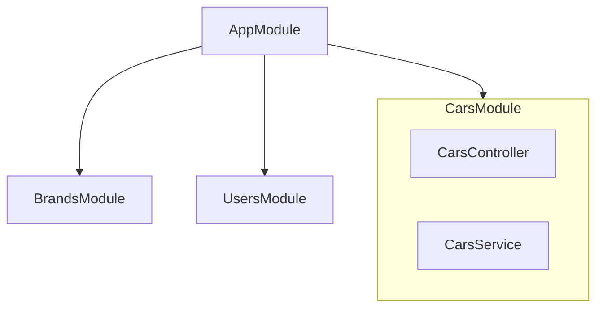

# Nivel 2: Conceptos Fundamentales de NestJS

Bienvenido al **Nivel 2** del ecosistema educativo de NestJS. En esta unidad, sentaremos las bases de la arquitectura de NestJS, analizando pieza por pieza cómo funciona el framework bajo el capó y cómo puedes construir APIs escalables siguiendo las mejores prácticas profesionales.

Tomaremos como base práctica la creación de una aplicación de concesionario de coches (Car Dealership), donde aprenderás a diseñar un CRUD (Create, Read, Update, Delete) en memoria, estructurado correctamente.

---

## 📑 Índice de Contenidos

1. [El CLI de NestJS](#1-el-cli-de-nestjs)
2. [Estructura y Módulos (`@Module`)](#2-estructura-y-módulos-module)
3. [Controladores (`@Controller`) y Endpoints](#3-controladores-controller-y-endpoints)
4. [Decoradores de Extracción de Datos](#4-decoradores-de-extracción-de-datos)
5. [Servicios e Inyección de Dependencias (DI)](#5-servicios-e-inyección-de-dependencias-di)
6. [Pipes de Transformación y Validación](#6-pipes-de-transformación-y-validación)
7. [Manejo Global de Excepciones](#7-manejo-global-de-excepciones)
8. [DTOs (Data Transfer Objects) e Interfaces](#8-dtos-data-transfer-objects-e-interfaces)
9. [Validación Avanzada: class-validator y class-transformer](#9-validación-avanzada-class-validator-y-class-transformer)
10. [ValidationPipe a Fondo](#10-validationpipe-a-fondo)
11. [UUID y ParseUUIDPipe](#11-uuid-y-parseuuidpipe)
12. [Organización de Código: Alias de Importación y Barrel Files](#12-organización-de-código-alias-de-importación-y-barrel-files)
13. [Proyecto Final de Unidad](#13-proyecto-final-de-unidad)

---

## 1. El CLI de NestJS

### ¿Qué es?

La interfaz de línea de comandos de NestJS (`@nestjs/cli`) es una herramienta de terminal que permite inicializar, desarrollar y mantener aplicaciones de manera estandarizada.

### ¿Por qué existe y qué problema resuelve?

En el ecosistema de Node.js (especialmente con Express), no existe una estructura predefinida. Esto causa que cada equipo invente su propia arquitectura, resultando en "código espagueti" o arquitecturas difíciles de mantener.
El CLI resuelve esto mediante la generación de código (**Scaffolding**), creando archivos, clases y configuraciones estandarizadas al instante, ahorrando tiempo y evitando errores humanos.

### Comandos Principales

| Comando                           |       Alias        | Descripción                                                 |
| :-------------------------------- | :----------------: | :---------------------------------------------------------- |
| `nest new <name>`                 |                    | Crea un proyecto nuevo completo.                            |
| `nest generate module <name>`     | `nest g mo <name>` | Genera un archivo `.module.ts` y lo registra.               |
| `nest generate controller <name>` | `nest g co <name>` | Genera un archivo `.controller.ts` y su archivo de testing. |
| `nest generate service <name>`    | `nest g s <name>`  | Genera un archivo `.service.ts`.                            |

### ❌ Errores comunes

- **Crear archivos a mano:** Evita crear `cars.controller.ts` manualmente. Usa `nest g co cars`. El CLI no solo crea el archivo, sino que lo importa automáticamente en el módulo correspondiente, evitando olvidar el registro y previniendo errores de compilación.

---

## 2. Estructura y Módulos (`@Module`)

### ¿Qué es un Módulo?

En NestJS, un Módulo es una clase decorada con `@Module()`. Sirve para agrupar componentes estrechamente relacionados en un dominio específico. Toda aplicación NestJS tiene un **Root Module** (generalmente llamado `AppModule`), que actúa como el punto de entrada.



### ¿Por qué existe?

Para garantizar que el código sea **altamente cohesivo** y **poco acoplado**. Un módulo encapsula la lógica de una entidad (ej. Coches).

### Cuándo utilizarlos

- **SIEMPRE** que crees un nuevo dominio o entidad en tu aplicación (ej: `Users`, `Products`, `Orders`). Debes crear un `Módulo` para cada uno.

### Cuándo NO utilizarlos

- No crees un módulo para una sola función aislada.
- No agrupes dominios que no tengan relación directa dentro del mismo módulo.

### Aplicación práctica

En nuestra aplicación de coches, la entidad principal es "Cars". Para aislarla del resto de la aplicación, creamos un `CarsModule`.

```typescript
// cars.module.ts
import { Module } from '@nestjs/common';
import { CarsController } from './cars.controller';
import { CarsService } from './cars.service';

@Module({
  controllers: [CarsController],
  providers: [CarsService],
})
export class CarsModule {}
```

---

## 3. Controladores (`@Controller`) y Endpoints

### ¿Qué son?

Son los encargados de **escuchar y responder** a las peticiones HTTP (GET, POST, PATCH, DELETE).

### ¿Qué problema resuelven?

Separan la capa de red (enrutamiento HTTP) de la lógica de negocio.

### Buenas y malas prácticas

✅ **Buena práctica:** El controlador debe ser extremadamente "tonto". Su única responsabilidad es recibir los datos, delegar la lógica compleja a un Servicio y retornar la respuesta.
❌ **Mala práctica:** Escribir reglas de negocio, cálculos complejos o consultas a la base de datos directamente dentro del Controlador.

### Decoradores de Métodos HTTP

Nest mapea métodos de clase a rutas HTTP usando decoradores.

| Decorador        | Método HTTP | Propósito                          | Ejemplo de Ruta |
| :--------------- | :---------- | :--------------------------------- | :-------------- |
| `@Get()`         | GET         | Leer datos                         | `/cars`         |
| `@Get(':id')`    | GET         | Leer un dato específico por ID     | `/cars/1`       |
| `@Post()`        | POST        | Crear un recurso nuevo             | `/cars`         |
| `@Patch(':id')`  | PATCH       | Actualizar parcialmente un recurso | `/cars/1`       |
| `@Delete(':id')` | DELETE      | Eliminar un recurso                | `/cars/1`       |

> **Nota:** La diferencia entre `PUT` y `PATCH` es que `PUT` reemplaza todo el recurso (si un campo falta, se borra), mientras que `PATCH` actualiza solo los campos enviados. En Nest y APIs modernas, es más común usar `PATCH`.

---

## 4. Decoradores de Extracción de Datos

Cuando un cliente hace una petición HTTP, a menudo envía datos (en la URL o en el cuerpo de la petición). NestJS provee decoradores para extraerlos fácilmente en los parámetros de nuestras funciones.

1. **`@Param('paramName')`**: Extrae segmentos de la URL. Ej. En `@Get(':id')`, extraemos el id con `@Param('id')`.
2. **`@Body()`**: Extrae el contenido JSON del cuerpo (payload) en las peticiones POST o PATCH.
3. **`@Query()`**: Extrae los parámetros de búsqueda. Ej. `/cars?brand=Toyota` -> `@Query('brand')`.

### Ejemplo

```typescript
@Patch(':id')
updateCar(
  @Param('id') id: string,
  @Body() body: any
) {
  return this.carsService.update(id, body);
}
```

---

## 5. Servicios e Inyección de Dependencias (DI)

### ¿Qué son los Servicios?

Son clases decoradas con `@Injectable()`. Representan la **Capa de Lógica de Negocio**. Son agnósticos a HTTP; no les importa si los datos provienen de una API REST, GraphQL o WebSockets.

### ¿Qué es la Inyección de Dependencias (DI)?

Es un patrón de diseño en el que un objeto no crea sus propias dependencias, sino que el framework se las proporciona (las inyecta).

### ¿Por qué existe y qué problema resuelve?

- **Desacoplamiento:** Permite intercambiar implementaciones fácilmente (ej. cambiar un servicio de base de datos en memoria por uno real de PostgreSQL).
- **Testing:** Facilita inyectar servicios falsos (mocks) durante las pruebas.
- **Singleton por defecto:** NestJS instancia el servicio **una sola vez** y comparte esa misma instancia con todo el módulo.

### ¿Cómo se aplica? (Constructor Shorthand)

Aprovechando TypeScript, inyectamos el servicio en el constructor del controlador usando `private readonly`.

```typescript
@Controller('cars')
export class CarsController {
  // NestJS instanciará CarsService automáticamente y lo asignará a this.carsService
  constructor(private readonly carsService: CarsService) {}
}
```

---

## 6. Pipes de Transformación y Validación

### ¿Qué es un Pipe?

Un Pipe es una clase que opera sobre los argumentos recibidos por la petición HTTP **antes** de que lleguen al método del controlador. Tienen dos usos principales:

1. **Transformación:** Convertir datos de entrada al formato deseado (ej. de un string `'1'` a un número `1`).
2. **Validación:** Comprobar si los datos de entrada son válidos. Si no lo son, el Pipe aborta la ejecución y lanza un error.

### El problema: Todo en la URL es un String

Cuando defines una ruta `/cars/:id` y haces una petición a `/cars/5`, ese `5` es capturado como el string `'5'`. Si el Servicio espera un número para buscar en la base de datos, fallará.

### Solución: `ParseIntPipe`

NestJS incluye `ParseIntPipe` para convertir el string de la URL en un número.

```typescript
@Get(':id')
findOneById(@Param('id', ParseIntPipe) id: number) {
  // Ahora 'id' es un number validado.
  // Si el cliente envía /cars/abc, Nest devolverá un Error 400 (Bad Request) automáticamente.
  return this.carsService.findOneById(id);
}
```

Otros pipes nativos útiles:

- `ParseBoolPipe`: Convierte `'true'` o `'false'` en booleanos.

---

## 7. Manejo Global de Excepciones

### ¿Qué son los Exception Filters?

En Node/Express tradicional, si ocurre un error inesperado, el servidor puede crashear. En NestJS, existe una capa global (Global Exception Filter) que atrapa todas las excepciones lanzadas en el código y devuelve respuestas HTTP estandarizadas.

### Clases de Excepción Incorporadas

Nest incluye clases de excepción para los códigos de estado HTTP más comunes.

| Clase                          | Código HTTP | Caso de Uso Frecuente                                       |
| :----------------------------- | :---------: | :---------------------------------------------------------- |
| `BadRequestException`          |     400     | El cliente envió datos inválidos o que faltan.              |
| `NotFoundException`            |     404     | El recurso solicitado por ID no existe en la base de datos. |
| `ForbiddenException`           |     403     | El usuario no tiene permisos.                               |
| `InternalServerErrorException` |     500     | Error del servidor o base de datos.                         |

### Aplicación práctica

Dentro del `CarsService`, cuando buscamos un coche por ID y no existe, no debemos devolver `null` (eso obligaría al controlador a verificar `null` y enviar el código HTTP). La **Lógica de Negocio** lanza la excepción, y Nest se encarga del resto.

```typescript
// cars.service.ts
findOneById(id: number) {
  const car = this.cars.find(car => car.id === id);
  if (!car) {
    // Aborta la ejecución y devuelve un JSON con statusCode 404
    throw new NotFoundException(`El coche con el id '${id}' no se encontró`);
  }
  return car;
}
```

---

## 8. Proyecto Final de Unidad

Para asentar todos los conocimientos teóricos, desarrollarás un proyecto integrador. Este proyecto deberá ser creado utilizando las herramientas CLI y aplicando estrictamente los patrones arquitectónicos aprendidos.

### Enunciado del Proyecto: Gestor de Tareas (Task Manager API)

Deberás construir desde cero un nuevo proyecto NestJS independiente (`nest new task-manager`) que gestione una lista de tareas (To-Do).

### Requisitos Técnicos

1. **Scaffolding:** Utilizar el CLI para generar el módulo, controlador y servicio de Tareas (`nest g res tasks --no-spec`).
2. **Endpoints (CRUD):**
   - `GET /tasks`: Obtener todas las tareas.
   - `GET /tasks/:id`: Obtener tarea por ID.
   - `POST /tasks`: Crear nueva tarea enviando un objeto con título y descripción.
   - `PATCH /tasks/:id`: Actualizar el estado o texto de una tarea existente.
   - `DELETE /tasks/:id`: Eliminar una tarea.
3. **Pipes:** El ID de las tareas debe ser un identificador numérico. Utiliza el decorador nativo `ParseIntPipe` para validar el ID en todas las rutas requeridas.
4. **Estado en Memoria:** Las tareas se almacenarán en un arreglo estático dentro del servicio. La interfaz `Task` debe tener la forma: `{ id: number, title: string, description: string, isCompleted: boolean }`.
5. **Manejo de Errores:** Lanzar un `NotFoundException` estandarizado si el usuario intenta obtener, actualizar o eliminar una tarea cuyo ID no existe en el sistema.

Este proyecto medirá tu capacidad de ensamblar la arquitectura de NestJS de forma completamente autónoma desde un lienzo en blanco.
